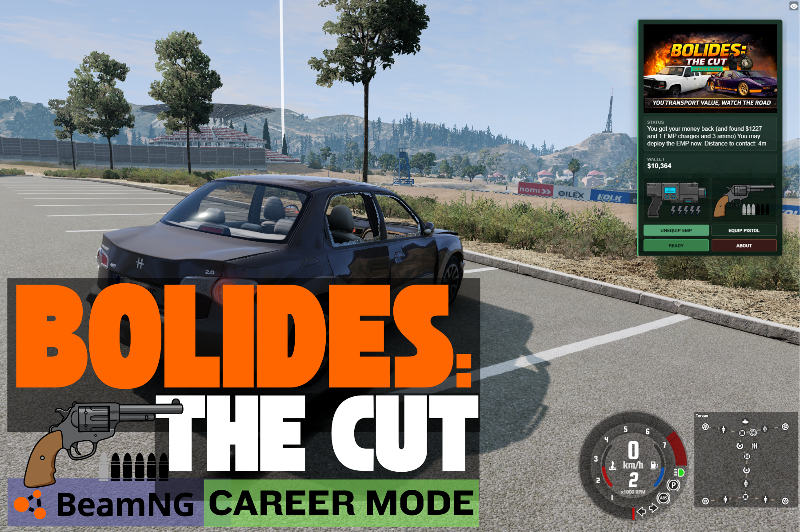

# Bolides – The Cut

### You transport value. Watch the road.

A career expansion for BeamNG.drive introducing a hostile criminal gang, calculated risk on every run and equipment and weapons. Your strategic choices determine whether you escape, fight back or profit.

**Works with**   
**Vanilla Career** and **RLS Career**.

-----------------------------------------------------

## Bolides The Cut Public Release Candidate (0.9 RC)

### Installation Guide

1. Download BolidesTheCutbyAbleMerickPublic_Release_Candidate_(0.9 RC).zip (see below)

2. Place the downloaded `.zip` file into your BeamNG `mods` folder.  
   *(Do not extract the zip.)*

3. Launch **BeamNG.drive** and start **Career Mode** as normal  
   (Vanilla Career or RLS Career).

4. Once in-game, open the **UI Apps** menu, go to **General** and add the  
   **BolideTheCutHUD** app.

-----------------------------------------------------

In standard career play, you build wealth through planning and discipline. Transport, taxi, drag builds, workshop and races....

**Bolides – The Cut exists to disrupt that.**

As you move value across the map, criminal events may unfold:
- Ambushes (EMP disables your vehicle to be robbed)
- Theft (up to half money total in your wallet)
- Bullet damage at the worst possible moment (bullet damage is explosive knocks to jbeams/ physics based collision damage)
- Intimidation
- The Bolides want their Cut 

Every run carries risk.

The Bolides are a roaming crime gang led by **Bonito Bolide**.

Bonito Bolide is the founder of **Bolide Motors** and the unseen head of
the Bolides crime network.

Publicly, he is known as an industrialist with property holdings in Italy and
interests in high-performance vehicle manufacturing. Privately, his fortune is
reinforced through organised criminal operations targeting high-value transport
and emerging career operators.

If you are making money on the road, Bonito Bolide is already aware of you.
 
**Custom AI switching Behaviours based on forward thinking**.
The Bolides use a custom lua trigger based ai switching to enable for example safe downhill chases and better safe corner speeds while still preserving good top speed. Essentially the Bolides will be better drivers and i intend to keep refining this aspect of the mod.

They take interest in anyone who appears to be building a future across:
- West Coast USA
- Italy
- Utah
- Any career-enabled RLS BeamNG map

If you look profitable, you look like a target.

Players can:
- Defend their cargo (EMP and pistol)
- Protect their earnings
- Turn the tables (take back robbed amounts plus extra money, ammo and EMP charges

Weapons and equipment may be obtained from the Bolides themselves, including:
- EMP and charges
- Pistols
- Ammunition

-----------------------------------------------------

### Public & Extended Editions

Bolides – The Cut is available as a free public release, offering the full core
experience — criminal encounters, risk, and consequence within Career Mode.

An **Extended Edition** is available via Patreon for players who want deeper
strategic control and expanded systems, including features such as
in-world purchasing of weapons ammo and equipment. New features. Constantly updated with new events

Both editions are stable and supported. Patreon directly funds continued
development and long-term expansion of the project.

-----------------------------------------------------

### Public Edition
- Core Bolides encounters  
- Gang ambush events  
- Weapon looting  
- Risk-driven gameplay  
-----------------------------------------------------

### Extended Edition
- Everything in Public Edition  
- Weapon & ammo purchasing  
- Support the Dev  
- New Bolides Events Added
- Bug fix on Beamng update happens here first
- Bolide AI actively iterated here
- Spawn, Breadcrumbs and Performance actively iterated
- Integration of New mods/gameplay
------------------------------------------------------   

### Built for stability

Bolides – The Cut is:
- **~95% Lua-based**
- Independent of BeamNG core code
- Independent of other mods
- Designed to be robust and low-maintenance

This approach ensures the mod:
- Plays well with updates
- Minimises breakage
- Integrates cleanly into existing career saves and other carreer mods

### Current release focus

The initial release focuses on:
- Gang encounters
- Robbery
- Vehicle damage via gunfire
- Player ability to obtain EMP and Pistol
- Strategic use of hard to come by ammo and charges

The system is intentionally modular and expandable.

### Looking ahead

Bolides – The Cut is built on a modular foundation, allowing new crime events,  
AI behaviours, and defensive tools to be introduced over time.

Future updates to Expanded Edition will add encounter variety and strategic depth while  
maintaining compatibility with existing career systems.

-----------------------------------------------------

### Community & Support

- 🎥 **YouTube** — https://www.youtube.com/@ablemerick
  watch gameplay and dev
  
- 💬 **Discord** — Join development discussion, report issues, and give feedback  
  https://discord.gg/jchHGWTS

- ❤️ **Patreon** — Support development and gain access to Extended Edition  
  https://patreon.com/AbleMerick

Bolides – The Cut does not replace career mode.  
It makes surviving it harder.

-----------------------------------------------------

This project is released under a Source-Available, Non-Commercial, No-Redistribution licence.

You are free to use and modify the code for personal use.
Redistribution, rehosting, or commercial use is not permitted without permission.
See the LICENSE file for full terms.

Disclaimer
This mod is provided “as is”, without warranty of any kind.
The author is not responsible for any damage, data loss, or issues arising from use of this mod.

This mod is a fictional gameplay experience and does not endorse real-world criminal activity or violence.
